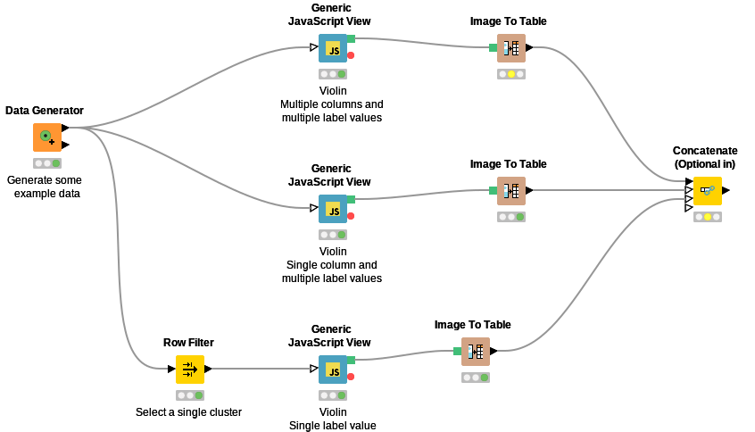
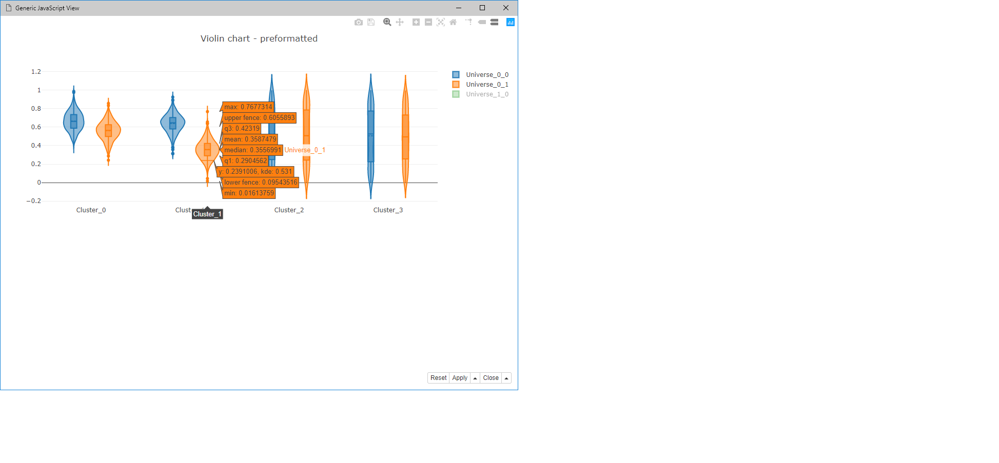
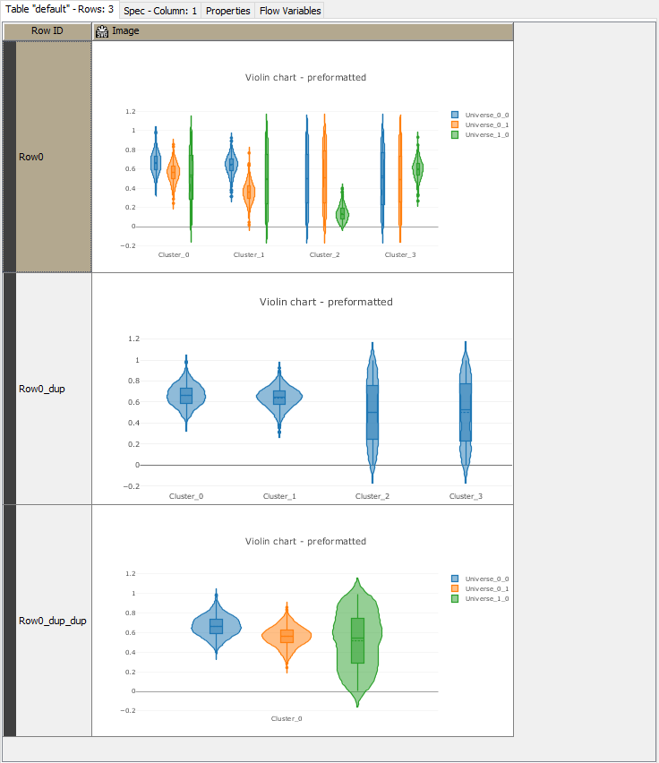

# Violin chart

KNIME integration of the plotly violin chart [https://plot.ly/javascript/violin/](https://plot.ly/javascript/violin/).

This implementation will give you a basic starting point and can be configured further. See the plotly documentation for available options.

## Workflow

Here is an example workflow with generated data showing different configurations.

## Output

### Live interaction

The plotly chart is interactive, the legend can be toggled and the graph will respond to hover events.

### SVG export

Depending on configuration various forms of output can be made. 

The first example image shows the output when configured with multiple columns and multiple values in the label column.

The second shows for a single column and multiple values in the label column.

The third shows for multiple columns and a single value in the label column.

